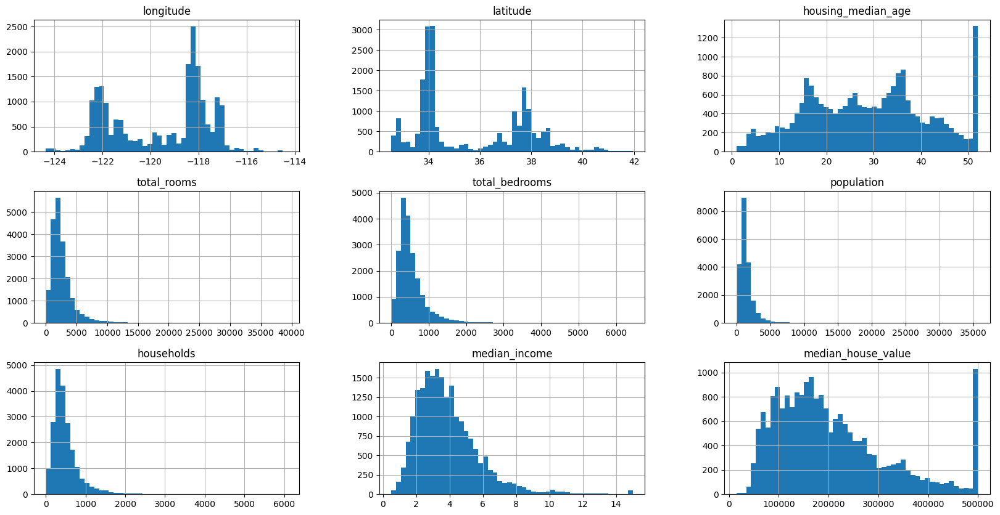
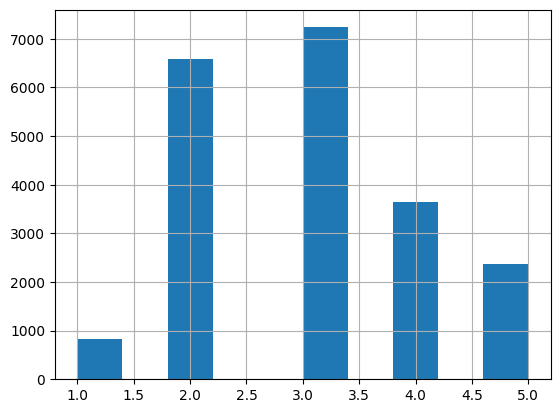
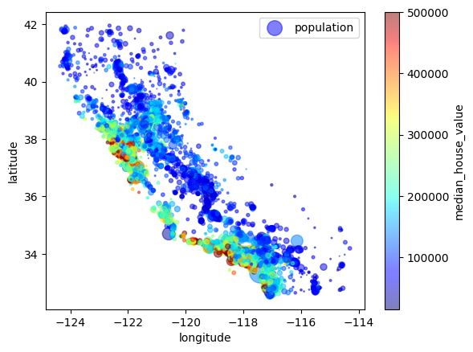
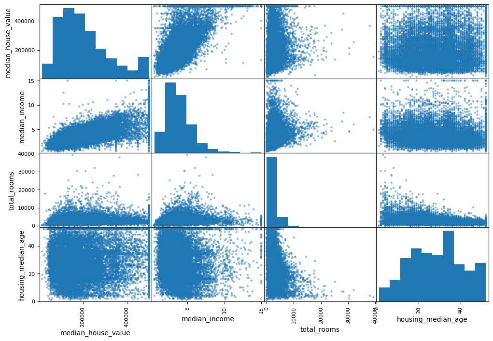
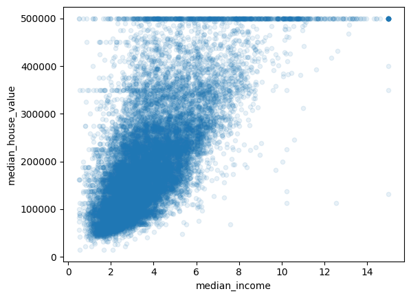

House pricing predictions
==============================

This is a learning activity based on the book "Hands-on Machine Learning with Scikit-Learn and TensorFlow 2" (Chapter 2). The main goal is to build a machine learning project from scratch. The result is a model trained to predict the median house price for any district in California. The final model is not perfect, but it allows for practicing various aspects of data science and learning new things.

# Housing data exploring and model creation

## Settings and preparation

### Imports


```python
import os
from pathlib import Path
import pandas as pd
import numpy as np
import joblib
import matplotlib.pyplot as plt
from sklearn.model_selection import (train_test_split, StratifiedShuffleSplit,
    cross_val_score, GridSearchCV, RandomizedSearchCV)
from sklearn.impute import SimpleImputer
from sklearn.preprocessing import OrdinalEncoder, OneHotEncoder
from sklearn.base import BaseEstimator, TransformerMixin
from sklearn.pipeline import Pipeline
from sklearn.preprocessing import StandardScaler
from sklearn.compose import ColumnTransformer
from sklearn.linear_model import LinearRegression
from sklearn.tree import DecisionTreeRegressor
from sklearn.metrics import mean_squared_error
from sklearn.ensemble import RandomForestRegressor
from scipy import stats

%matplotlib inline
```

### Download the data

To download the data required to run this notebook execute the script 'src/data/download_housing_dataset.py' from the console. Use a module-like execution (python -m src.data.download_housing_dataset)

### Constants


```python
PROJECT_ROOT_PATH = Path(os.path.abspath('')).parent
PROJECT_DATA_PATH = PROJECT_ROOT_PATH / 'data'
PROJECT_MODELS_PATH = PROJECT_ROOT_PATH / 'models'
HOUSING_DATASET_PATH = PROJECT_DATA_PATH / 'raw/housing/housing.csv'
```

### Load the data


```python
def load_housing_data(file_path=HOUSING_DATASET_PATH):
    return pd.read_csv(file_path)
```


```python
housing_dataset = load_housing_data()
housing_dataset.head()
```


<div>
<style scoped>
    .dataframe tbody tr th:only-of-type {
        vertical-align: middle;
    }

    .dataframe tbody tr th {
        vertical-align: top;
    }

    .dataframe thead th {
        text-align: right;
    }
</style>
<table border="1" class="dataframe">
  <thead>
    <tr style="text-align: right;">
      <th></th>
      <th>longitude</th>
      <th>latitude</th>
      <th>housing_median_age</th>
      <th>total_rooms</th>
      <th>total_bedrooms</th>
      <th>population</th>
      <th>households</th>
      <th>median_income</th>
      <th>median_house_value</th>
      <th>ocean_proximity</th>
    </tr>
  </thead>
  <tbody>
    <tr>
      <th>0</th>
      <td>-122.23</td>
      <td>37.88</td>
      <td>41.0</td>
      <td>880.0</td>
      <td>129.0</td>
      <td>322.0</td>
      <td>126.0</td>
      <td>8.3252</td>
      <td>452600.0</td>
      <td>NEAR BAY</td>
    </tr>
    <tr>
      <th>1</th>
      <td>-122.22</td>
      <td>37.86</td>
      <td>21.0</td>
      <td>7099.0</td>
      <td>1106.0</td>
      <td>2401.0</td>
      <td>1138.0</td>
      <td>8.3014</td>
      <td>358500.0</td>
      <td>NEAR BAY</td>
    </tr>
    <tr>
      <th>2</th>
      <td>-122.24</td>
      <td>37.85</td>
      <td>52.0</td>
      <td>1467.0</td>
      <td>190.0</td>
      <td>496.0</td>
      <td>177.0</td>
      <td>7.2574</td>
      <td>352100.0</td>
      <td>NEAR BAY</td>
    </tr>
    <tr>
      <th>3</th>
      <td>-122.25</td>
      <td>37.85</td>
      <td>52.0</td>
      <td>1274.0</td>
      <td>235.0</td>
      <td>558.0</td>
      <td>219.0</td>
      <td>5.6431</td>
      <td>341300.0</td>
      <td>NEAR BAY</td>
    </tr>
    <tr>
      <th>4</th>
      <td>-122.25</td>
      <td>37.85</td>
      <td>52.0</td>
      <td>1627.0</td>
      <td>280.0</td>
      <td>565.0</td>
      <td>259.0</td>
      <td>3.8462</td>
      <td>342200.0</td>
      <td>NEAR BAY</td>
    </tr>
  </tbody>
</table>
</div>


## Exploratory analysis


```python
housing_dataset.info()
```

    <class 'pandas.core.frame.DataFrame'>
    RangeIndex: 20640 entries, 0 to 20639
    Data columns (total 10 columns):
     #   Column              Non-Null Count  Dtype  
    ---  ------              --------------  -----  
     0   longitude           20640 non-null  float64
     1   latitude            20640 non-null  float64
     2   housing_median_age  20640 non-null  float64
     3   total_rooms         20640 non-null  float64
     4   total_bedrooms      20433 non-null  float64
     5   population          20640 non-null  float64
     6   households          20640 non-null  float64
     7   median_income       20640 non-null  float64
     8   median_house_value  20640 non-null  float64
     9   ocean_proximity     20640 non-null  object 
    dtypes: float64(9), object(1)
    memory usage: 1.6+ MB


```python
housing_dataset['ocean_proximity'].value_counts()
```


    ocean_proximity
    <1H OCEAN     9136
    INLAND        6551
    NEAR OCEAN    2658
    NEAR BAY      2290
    ISLAND           5
    Name: count, dtype: int64


```python
housing_dataset.describe()
```


<div>
<style scoped>
    .dataframe tbody tr th:only-of-type {
        vertical-align: middle;
    }

    .dataframe tbody tr th {
        vertical-align: top;
    }

    .dataframe thead th {
        text-align: right;
    }
</style>
<table border="1" class="dataframe">
  <thead>
    <tr style="text-align: right;">
      <th></th>
      <th>longitude</th>
      <th>latitude</th>
      <th>housing_median_age</th>
      <th>total_rooms</th>
      <th>total_bedrooms</th>
      <th>population</th>
      <th>households</th>
      <th>median_income</th>
      <th>median_house_value</th>
    </tr>
  </thead>
  <tbody>
    <tr>
      <th>count</th>
      <td>20640.000000</td>
      <td>20640.000000</td>
      <td>20640.000000</td>
      <td>20640.000000</td>
      <td>20433.000000</td>
      <td>20640.000000</td>
      <td>20640.000000</td>
      <td>20640.000000</td>
      <td>20640.000000</td>
    </tr>
    <tr>
      <th>mean</th>
      <td>-119.569704</td>
      <td>35.631861</td>
      <td>28.639486</td>
      <td>2635.763081</td>
      <td>537.870553</td>
      <td>1425.476744</td>
      <td>499.539680</td>
      <td>3.870671</td>
      <td>206855.816909</td>
    </tr>
    <tr>
      <th>std</th>
      <td>2.003532</td>
      <td>2.135952</td>
      <td>12.585558</td>
      <td>2181.615252</td>
      <td>421.385070</td>
      <td>1132.462122</td>
      <td>382.329753</td>
      <td>1.899822</td>
      <td>115395.615874</td>
    </tr>
    <tr>
      <th>min</th>
      <td>-124.350000</td>
      <td>32.540000</td>
      <td>1.000000</td>
      <td>2.000000</td>
      <td>1.000000</td>
      <td>3.000000</td>
      <td>1.000000</td>
      <td>0.499900</td>
      <td>14999.000000</td>
    </tr>
    <tr>
      <th>25%</th>
      <td>-121.800000</td>
      <td>33.930000</td>
      <td>18.000000</td>
      <td>1447.750000</td>
      <td>296.000000</td>
      <td>787.000000</td>
      <td>280.000000</td>
      <td>2.563400</td>
      <td>119600.000000</td>
    </tr>
    <tr>
      <th>50%</th>
      <td>-118.490000</td>
      <td>34.260000</td>
      <td>29.000000</td>
      <td>2127.000000</td>
      <td>435.000000</td>
      <td>1166.000000</td>
      <td>409.000000</td>
      <td>3.534800</td>
      <td>179700.000000</td>
    </tr>
    <tr>
      <th>75%</th>
      <td>-118.010000</td>
      <td>37.710000</td>
      <td>37.000000</td>
      <td>3148.000000</td>
      <td>647.000000</td>
      <td>1725.000000</td>
      <td>605.000000</td>
      <td>4.743250</td>
      <td>264725.000000</td>
    </tr>
    <tr>
      <th>max</th>
      <td>-114.310000</td>
      <td>41.950000</td>
      <td>52.000000</td>
      <td>39320.000000</td>
      <td>6445.000000</td>
      <td>35682.000000</td>
      <td>6082.000000</td>
      <td>15.000100</td>
      <td>500001.000000</td>
    </tr>
  </tbody>
</table>
</div>


```python
housing_dataset.hist(bins=50, figsize=(20, 10))
plt.show()
```


    

    


## Preprocessing


```python
housing_dataset['income_category'] = pd.cut(
    housing_dataset['median_income'],
    bins=[0.0, 1.5, 3.0, 4.5, 6.0, np.inf],
    labels=[1, 2, 3, 4, 5]
)

housing_dataset['income_category'].hist()
plt.show()
```


    

    


### Stratified sampling


```python
splitter = StratifiedShuffleSplit(n_splits=1, test_size=0.2, random_state=42)

for train_index, test_index in splitter.split(housing_dataset, housing_dataset['income_category']):
    strat_train_set = housing_dataset.loc[train_index]
    strat_test_set = housing_dataset.loc[test_index]
```


```python
strat_test_set['income_category'].value_counts()
```


    income_category
    3    1447
    2    1316
    4     728
    5     472
    1     165
    Name: count, dtype: int64


```python
for set_ in (strat_train_set, strat_test_set):
    set_.drop('income_category', axis=1, inplace=True)
```

### Discovering and visualizing


```python
housing_exploring_set = strat_train_set.copy()
```


```python
housing_exploring_set.plot(kind='scatter', x='longitude', y='latitude', alpha=0.5,
                           s=housing_exploring_set['population']/100, label='population',
                           c='median_house_value', cmap=plt.get_cmap('jet'), colorbar=True
                          )
plt.show()
```


    

    


```python
correlation_matrix = housing_exploring_set.drop('ocean_proximity', axis=1, inplace=False).corr()
correlation_matrix['median_house_value'].sort_values(ascending=False)
```


    median_house_value    1.000000
    median_income         0.687151
    total_rooms           0.135140
    housing_median_age    0.114146
    households            0.064590
    total_bedrooms        0.047781
    population           -0.026882
    longitude            -0.047466
    latitude             -0.142673
    Name: median_house_value, dtype: float64


```python
attributes = ['median_house_value', 'median_income', 'total_rooms', 'housing_median_age']
pd.plotting.scatter_matrix(housing_exploring_set[attributes], figsize=(12, 8))
plt.show()
```


    

    


```python
housing_exploring_set.plot(kind='scatter', x='median_income', y='median_house_value', alpha=0.1)
plt.show()
```


    

    


### Attributes combinations


```python
housing_exploring_set['rooms_per_household'] = housing_exploring_set['total_rooms'] / housing_exploring_set['households']
housing_exploring_set['bedrooms_per_room'] = housing_exploring_set['total_bedrooms'] / housing_exploring_set['total_rooms']
housing_exploring_set['population_per_household'] = housing_exploring_set['population'] / housing_exploring_set['households']
```


```python
correlation_matrix = housing_exploring_set.drop('ocean_proximity', axis=1, inplace=False).corr()
correlation_matrix['median_house_value'].sort_values(ascending=False)
```


    median_house_value          1.000000
    median_income               0.687151
    rooms_per_household         0.146255
    total_rooms                 0.135140
    housing_median_age          0.114146
    households                  0.064590
    total_bedrooms              0.047781
    population_per_household   -0.021991
    population                 -0.026882
    longitude                  -0.047466
    latitude                   -0.142673
    bedrooms_per_room          -0.259952
    Name: median_house_value, dtype: float64


## Data preparing for Machine Learning Algorithms


```python
housing_train_attributes = strat_train_set.drop('median_house_value', axis=1)
housing_train_labels = strat_train_set['median_house_value'].copy()
```


```python
imputer = SimpleImputer(strategy='median')
housing_numerical = housing_train_attributes.drop('ocean_proximity', axis=1)
imputer.fit(housing_numerical)
print(imputer.statistics_)
print(housing_numerical.median())
```

    [-118.51      34.26      29.      2119.       433.      1164.
      408.         3.54155]
    longitude             -118.51000
    latitude                34.26000
    housing_median_age      29.00000
    total_rooms           2119.00000
    total_bedrooms         433.00000
    population            1164.00000
    households             408.00000
    median_income            3.54155
    dtype: float64


```python
housing_numerical_transformed_values = imputer.transform(housing_numerical)
housing_numerical_transformed = pd.DataFrame(housing_numerical_transformed_values, columns=housing_numerical.columns)
housing_numerical_transformed.describe()
```


<div>
<style scoped>
    .dataframe tbody tr th:only-of-type {
        vertical-align: middle;
    }

    .dataframe tbody tr th {
        vertical-align: top;
    }

    .dataframe thead th {
        text-align: right;
    }
</style>
<table border="1" class="dataframe">
  <thead>
    <tr style="text-align: right;">
      <th></th>
      <th>longitude</th>
      <th>latitude</th>
      <th>housing_median_age</th>
      <th>total_rooms</th>
      <th>total_bedrooms</th>
      <th>population</th>
      <th>households</th>
      <th>median_income</th>
    </tr>
  </thead>
  <tbody>
    <tr>
      <th>count</th>
      <td>16512.000000</td>
      <td>16512.000000</td>
      <td>16512.000000</td>
      <td>16512.000000</td>
      <td>16512.000000</td>
      <td>16512.000000</td>
      <td>16512.000000</td>
      <td>16512.000000</td>
    </tr>
    <tr>
      <th>mean</th>
      <td>-119.575635</td>
      <td>35.639314</td>
      <td>28.653404</td>
      <td>2622.539789</td>
      <td>533.939438</td>
      <td>1419.687379</td>
      <td>497.011810</td>
      <td>3.875884</td>
    </tr>
    <tr>
      <th>std</th>
      <td>2.001828</td>
      <td>2.137963</td>
      <td>12.574819</td>
      <td>2138.417080</td>
      <td>410.806260</td>
      <td>1115.663036</td>
      <td>375.696156</td>
      <td>1.904931</td>
    </tr>
    <tr>
      <th>min</th>
      <td>-124.350000</td>
      <td>32.540000</td>
      <td>1.000000</td>
      <td>6.000000</td>
      <td>2.000000</td>
      <td>3.000000</td>
      <td>2.000000</td>
      <td>0.499900</td>
    </tr>
    <tr>
      <th>25%</th>
      <td>-121.800000</td>
      <td>33.940000</td>
      <td>18.000000</td>
      <td>1443.000000</td>
      <td>296.000000</td>
      <td>784.000000</td>
      <td>279.000000</td>
      <td>2.566950</td>
    </tr>
    <tr>
      <th>50%</th>
      <td>-118.510000</td>
      <td>34.260000</td>
      <td>29.000000</td>
      <td>2119.000000</td>
      <td>433.000000</td>
      <td>1164.000000</td>
      <td>408.000000</td>
      <td>3.541550</td>
    </tr>
    <tr>
      <th>75%</th>
      <td>-118.010000</td>
      <td>37.720000</td>
      <td>37.000000</td>
      <td>3141.000000</td>
      <td>641.000000</td>
      <td>1719.000000</td>
      <td>602.000000</td>
      <td>4.745325</td>
    </tr>
    <tr>
      <th>max</th>
      <td>-114.310000</td>
      <td>41.950000</td>
      <td>52.000000</td>
      <td>39320.000000</td>
      <td>6210.000000</td>
      <td>35682.000000</td>
      <td>5358.000000</td>
      <td>15.000100</td>
    </tr>
  </tbody>
</table>
</div>


```python
ordinal_encoder = OrdinalEncoder()
housing_categorical = housing_train_attributes[['ocean_proximity']]
housing_categorical_encoded = ordinal_encoder.fit_transform(housing_categorical)
print(housing_categorical_encoded)
print(ordinal_encoder.categories_)
```

    [[1.]
     [4.]
     [1.]
     ...
     [0.]
     [0.]
     [1.]]
    [array(['<1H OCEAN', 'INLAND', 'ISLAND', 'NEAR BAY', 'NEAR OCEAN'],
          dtype=object)]


```python
one_hot_encoder = OneHotEncoder()
housing_categorical_one_hot_encoded = one_hot_encoder.fit_transform(housing_categorical)
print(housing_categorical_one_hot_encoded.toarray())
print(one_hot_encoder.categories_)
```

    [[0. 1. 0. 0. 0.]
     [0. 0. 0. 0. 1.]
     [0. 1. 0. 0. 0.]
     ...
     [1. 0. 0. 0. 0.]
     [1. 0. 0. 0. 0.]
     [0. 1. 0. 0. 0.]]
    [array(['<1H OCEAN', 'INLAND', 'ISLAND', 'NEAR BAY', 'NEAR OCEAN'],
          dtype=object)]


### Custom transformers


```python
class CombinedAttributesAdder(BaseEstimator, TransformerMixin):
    def __init__(self, add_bedrooms_per_room=True):
        self.add_bedrooms_per_room = add_bedrooms_per_room

    def fit(self, X, y=None):
        return self

    def transform(self, X, y=None):
        rooms_ix, bedrooms_ix, population_ix, households_ix = 3, 4, 5, 6
        rooms_per_household = X[:, rooms_ix] / X[:, households_ix]
        population_per_household = X[:, population_ix] / X[:, households_ix]
        if self.add_bedrooms_per_room:
            bedrooms_per_room = X[:, bedrooms_ix] / X[:, rooms_ix]
            return np.c_[X, rooms_per_household, population_per_household, bedrooms_per_room]
        else:
            return np.c_[X, rooms_per_household, population_per_household]
        
```


```python
combined_attribute_added_encoder = CombinedAttributesAdder(add_bedrooms_per_room=False)
housing_combined_attributes_encoded = combined_attribute_added_encoder.transform(housing_train_attributes.values)
print(housing_combined_attributes_encoded)
```

    [[-121.46 38.52 29.0 ... 'INLAND' 5.485835694050992 3.168555240793201]
     [-117.23 33.09 7.0 ... 'NEAR OCEAN' 6.927083333333333 2.6236979166666665]
     [-119.04 35.37 44.0 ... 'INLAND' 5.3933333333333335 2.223333333333333]
     ...
     [-122.72 38.44 48.0 ... '<1H OCEAN' 4.1104651162790695
      2.6627906976744184]
     [-122.7 38.31 14.0 ... '<1H OCEAN' 6.297405189620759 2.411177644710579]
     [-122.14 39.97 27.0 ... 'INLAND' 5.477157360406092 3.1725888324873095]]


### Transformation pipelines


```python
numerical_pipeline = Pipeline([
    ('imputer', SimpleImputer(strategy='median')),
    ('combinated_attributes_adder', CombinedAttributesAdder()),
    ('std_scaler', StandardScaler())
])

housing_numerical_training = numerical_pipeline.fit_transform(housing_numerical)
```


```python
categorical_pipeline = Pipeline([
    ('ocean_proximity_enconder', OneHotEncoder())
])
```


```python
numerical_attributes = list(housing_numerical)
categorical_attributes = ['ocean_proximity']

full_pipeline = ColumnTransformer([
    ('numerical_pipeline', numerical_pipeline, numerical_attributes),
    ('categorical_pipeline', categorical_pipeline, categorical_attributes)
])

housing_prepared = full_pipeline.fit_transform(housing_train_attributes)
```

## Select and train a model

### Linear regression


```python
linear_regressor = LinearRegression()
linear_regressor.fit(housing_prepared, housing_train_labels)
```

```python
sample_data = housing_train_attributes.iloc[:5]
sample_labels = housing_train_labels.iloc[:5]
sample_data_prepared = full_pipeline.transform(sample_data)
sample_predictions = linear_regressor.predict(sample_data_prepared)
print(list(zip(sample_labels, sample_predictions)))
```

    [(72100.0, 85657.90192014369), (279600.0, 305492.60737487697), (82700.0, 152056.46122455696), (112500.0, 186095.70946094402), (238300.0, 244550.67966088964)]


```python
housing_training_predictions = linear_regressor.predict(housing_prepared)
rmse_error = np.sqrt(mean_squared_error(y_true=housing_train_labels, y_pred=housing_training_predictions))
print(f'RMSE: {rmse_error}')
```

    RMSE: 68627.87390018745


```python
scores = cross_val_score(linear_regressor, housing_prepared, housing_train_labels, scoring='neg_mean_squared_error', cv=10)
tree_rmse_scores = np.sqrt(-scores)
print(f'Scores: {tree_rmse_scores}')
print(f'Mean: {tree_rmse_scores.mean()}')
print(f'Standard deviation: {tree_rmse_scores.std()}')
```

    Scores: [71762.76364394 64114.99166359 67771.17124356 68635.19072082
     66846.14089488 72528.03725385 73997.08050233 68802.33629334
     66443.28836884 70139.79923956]
    Mean: 69104.07998247063
    Standard deviation: 2880.3282098180634


### Decision tree tegression


```python
decision_tree_regressor = DecisionTreeRegressor()
decision_tree_regressor.fit(housing_prepared, housing_train_labels)
```


```python
sample_data = housing_train_attributes.iloc[:5]
sample_labels = housing_train_labels.iloc[:5]
sample_data_prepared = full_pipeline.transform(sample_data)
sample_predictions = decision_tree_regressor.predict(sample_data_prepared)
print(list(zip(sample_labels, sample_predictions)))
```

    [(72100.0, 72100.0), (279600.0, 279600.0), (82700.0, 82700.0), (112500.0, 112500.0), (238300.0, 238300.0)]


```python
housing_training_predictions = decision_tree_regressor.predict(housing_prepared)
rmse_error = np.sqrt(mean_squared_error(y_true=housing_train_labels, y_pred=housing_training_predictions))
print(f'RMSE: {rmse_error}') # 0.0 Bad evaluated, just for learnign purposes
```

    RMSE: 0.0


```python
scores = cross_val_score(decision_tree_regressor, housing_prepared, housing_train_labels, scoring='neg_mean_squared_error', cv=10)
tree_rmse_scores = np.sqrt(-scores)
print(f'Scores: {tree_rmse_scores}')
print(f'Mean: {tree_rmse_scores.mean()}')
print(f'Standard deviation: {tree_rmse_scores.std()}')
```

    Scores: [73334.1451505  69988.43924538 68810.56279435 71133.43503112
     68847.6624943  77897.74904899 70207.19857395 73999.56846284
     67793.16567037 71764.14246903]
    Mean: 71377.60689408153
    Standard deviation: 2873.3639369324605


### Random forest regression


```python
random_forest_regressor = RandomForestRegressor()
random_forest_regressor.fit(housing_prepared, housing_train_labels)
```


```python
sample_data = housing_train_attributes.iloc[:5]
sample_labels = housing_train_labels.iloc[:5]
sample_data_prepared = full_pipeline.transform(sample_data)
sample_predictions = random_forest_regressor.predict(sample_data_prepared)
print(list(zip(sample_labels, sample_predictions)))
```

    [(72100.0, 76051.0), (279600.0, 294935.0), (82700.0, 82281.0), (112500.0, 120628.0), (238300.0, 232934.0)]


```python
housing_training_predictions = random_forest_regressor.predict(housing_prepared)
rmse_error = np.sqrt(mean_squared_error(y_true=housing_train_labels, y_pred=housing_training_predictions))
print(f'RMSE: {rmse_error}')
```

    RMSE: 18663.448246768443


```python
scores = cross_val_score(random_forest_regressor, housing_prepared, housing_train_labels, scoring='neg_mean_squared_error', cv=10)
tree_rmse_scores = np.sqrt(-scores)
print(f'Scores: {tree_rmse_scores}')
print(f'Mean: {tree_rmse_scores.mean()}')
print(f'Standard deviation: {tree_rmse_scores.std()}')
```

    Scores: [51464.57944776 48615.77924321 46756.75106573 52058.3869931
     47172.85568432 51483.13845679 52549.31237752 50241.11918895
     48193.79885799 54381.53282014]
    Mean: 50291.72541355006
    Standard deviation: 2391.138070056621


### Save models


```python
# joblib.dump(linear_regressor, PROJECT_MODELS_PATH / 'housing/experimental/linear_regressor_v1.pkl')
# joblib.dump(decision_tree_regressor, PROJECT_MODELS_PATH / 'housing/experimental/decision_tree_regressor_v1.pkl')
# joblib.dump(random_forest_regressor, PROJECT_MODELS_PATH / 'housing/experimental/random_forest_regressor_v1.pkl')
```

### Fine tuning

#### Grid search


```python
param_grid = [
    {
        'n_estimators': [3, 10, 30],
        'max_features': [2, 4, 6, 8]
    },
    {
        'bootstrap': [False],
        'n_estimators': [3, 10],
        'max_features': [2, 3, 4]
    }
]

random_forest_regressor_tuned = RandomForestRegressor()
grid_search = GridSearchCV(
    random_forest_regressor, param_grid, cv=5, scoring='neg_mean_squared_error',
    return_train_score=True
)

grid_search.fit(housing_prepared, housing_train_labels)
```


```python
print(grid_search.best_params_)
grid_search.best_estimator_
```

    {'max_features': 6, 'n_estimators': 30}


```python
cv_results = grid_search.cv_results_
for mean_score, params in zip(cv_results['mean_test_score'], cv_results['params']):
    print(np.sqrt(-mean_score), params)
```

    63968.369017361765 {'max_features': 2, 'n_estimators': 3}
    55637.31143045922 {'max_features': 2, 'n_estimators': 10}
    52971.24901701493 {'max_features': 2, 'n_estimators': 30}
    60122.0209208188 {'max_features': 4, 'n_estimators': 3}
    52608.40959523113 {'max_features': 4, 'n_estimators': 10}
    50684.49003990182 {'max_features': 4, 'n_estimators': 30}
    59007.851552140586 {'max_features': 6, 'n_estimators': 3}
    52048.49836428762 {'max_features': 6, 'n_estimators': 10}
    49726.905827255076 {'max_features': 6, 'n_estimators': 30}
    58617.38226355185 {'max_features': 8, 'n_estimators': 3}
    52297.05846240349 {'max_features': 8, 'n_estimators': 10}
    49848.12037895556 {'max_features': 8, 'n_estimators': 30}
    62603.49078241485 {'bootstrap': False, 'max_features': 2, 'n_estimators': 3}
    54556.74287205402 {'bootstrap': False, 'max_features': 2, 'n_estimators': 10}
    60054.584168874084 {'bootstrap': False, 'max_features': 3, 'n_estimators': 3}
    52583.63301867035 {'bootstrap': False, 'max_features': 3, 'n_estimators': 10}
    59346.20643051734 {'bootstrap': False, 'max_features': 4, 'n_estimators': 3}
    51487.71835878797 {'bootstrap': False, 'max_features': 4, 'n_estimators': 10}


```python
feature_importances = grid_search.best_estimator_.feature_importances_
print(feature_importances)
```

    [8.27467408e-02 6.73225816e-02 4.04371650e-02 1.81430594e-02
     1.64193521e-02 1.69346794e-02 1.62908329e-02 3.19994499e-01
     5.28636182e-02 1.06525762e-01 8.32490806e-02 1.34522095e-02
     1.55614973e-01 3.31113630e-05 4.22415697e-03 5.74817868e-03]


```python
extra_attributes = ['rooms_per_hold', 'pop_per_hold', 'bedrooms_per_room']
categorical_encoder = full_pipeline.named_transformers_['categorical_pipeline']
one_hot_encoder_attributes = list(categorical_encoder.steps[0][1].categories_[0])
attributes = numerical_attributes + extra_attributes + one_hot_encoder_attributes
sorted(zip(feature_importances, attributes), reverse=True)
```


    [(0.3199944985832763, 'median_income'),
     (0.1556149730624836, 'INLAND'),
     (0.10652576177433246, 'pop_per_hold'),
     (0.08324908059272784, 'bedrooms_per_room'),
     (0.0827467408205209, 'longitude'),
     (0.0673225816364563, 'latitude'),
     (0.05286361824315817, 'rooms_per_hold'),
     (0.040437165038174315, 'housing_median_age'),
     (0.01814305939859338, 'total_rooms'),
     (0.016934679438094846, 'population'),
     (0.01641935205592833, 'total_bedrooms'),
     (0.016290832864548795, 'households'),
     (0.013452209477310692, '<1H OCEAN'),
     (0.005748178683995562, 'NEAR OCEAN'),
     (0.004224156967446986, 'NEAR BAY'),
     (3.311136295160825e-05, 'ISLAND')]


### Model evaluation


```python
final_model = grid_search.best_estimator_

X_test = strat_test_set.drop('median_house_value', axis=1)
y_test = strat_test_set['median_house_value'].copy()

X_test_prepared = full_pipeline.transform(X_test)
y_predicted = final_model.predict(X_test_prepared)

final_mse = np.sqrt(mean_squared_error(y_true=y_test, y_pred=y_predicted))
print(f'RMSE: {final_mse}')
```

    RMSE: 47692.73868183871


```python
confidence = 0.95
squared_errors = (y_test - y_predicted) ** 2
confidence_interval = np.sqrt(
    stats.t.interval(
        confidence, len(squared_errors) -1, loc=squared_errors.mean(), scale=stats.sem(squared_errors)
    )
)

print(confidence_interval)
```

    [45712.16678617 49594.27843674]

